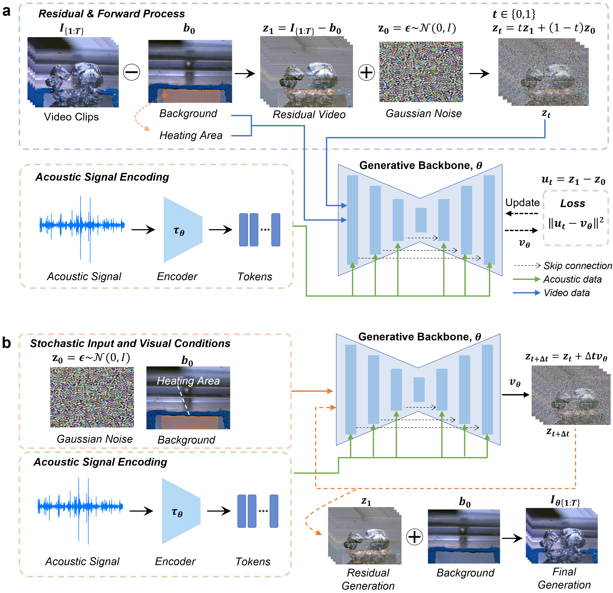

# Acoustic-to-video pool-boiling generation

This repository contains the code and a representative data subset for the manuscript:

**Non-invasive visualization of boiling from sound using a generative model**

<p align="center">
  
</p>

The main model is a **no-video-prior residual conditional flow-matching U-Net** for generating pool-boiling videos from deployable measurements:

- raw-amplitude CSV acoustic waveform
- static background image
- heating region-of-interest (ROI) mask

The final model does **not** require video-derived nucleation priors, future frames, heat-flux labels, HTC labels, or boiling-regime labels at inference.

## Repository Contents

```text
flow_residual/                         Proposed flow-matching model, dataset, metrics
residual_video/                        Shared video/audio dataset utilities
svd_audio_control/                     Video I/O helpers
ldm_residual/                          Latent diffusion baseline utilities
scripts/                              Training, inference, evaluation, timing scripts
configs/                              Model configuration files
assets/github_teaser.png              Repository landing figure
assets/paper_figures/                 Manuscript figures used for repository overview
assets/paper_selected_videos/         MP4 rollouts used for manuscript figures
assets/model_rollouts/                Full test rollout media for compared models
examples/train_50pct_representative/  Representative public subset of the training split
examples/val_50pct_representative/    Representative public subset of the validation split
examples/test_full/                   Full held-out test split
examples/manifests/                   JSONL manifests for the example subset
results/benchmark_matrix.xlsx         Model comparison table used in the manuscript
checkpoints/                          Local placement for downloaded trained checkpoints
expected_outputs/                     Placeholder for example generated outputs
```

## Manuscript Figures and Example Videos

The repository landing image is copied from the submitted manuscript figure folder:

```text
assets/github_teaser.png              same source as assets/paper_figures/Figure2.png
```

Additional manuscript figures are provided for reviewer orientation:

```text
assets/paper_figures/Figure1.png      experimental setup and paired acoustic/visual data
assets/paper_figures/Figure2.png      training and inference scheme of the proposed model
assets/paper_figures/Figure5.png      qualitative comparison across model families
```

The paper-selected generated videos are stored as MP4 files:

```text
assets/paper_selected_videos/
```

## Public Example Dataset

The `examples/` folder contains a representative public release of the corrected CSV acoustic-video dataset:

- `train_50pct_representative/`: 53 of 107 training cases
- `val_50pct_representative/`: 8 of 13 validation cases
- `test_full/`: 14 of 14 test cases (100%)

The train and validation subsets were selected to preserve heat-flux coverage. The full held-out test split is included so reviewers can run inference and evaluate the reported test behaviour directly.

Included per case:

- CSV acoustic waveform
- 100-fps RGB video
- static background image
- heating ROI mask

Release summary:

```text
Train: 53 cases
Validation: 8 cases
Test: 14 cases
Train heat-flux coverage: 0, 5, 20, 30, 40, 100, 200, 300, 400, 500, 600, 700, 800, 900 kW/m^2
Test heat-flux coverage: 20, 30, 40, 100, 200, 300, 400, 500, 600, 700, 895 kW/m^2
```

The manifests are:

```text
examples/manifests/train_50pct_representative.jsonl
examples/manifests/val_50pct_representative.jsonl
examples/manifests/test_full.jsonl
```

A small three-case demo manifest is also provided:

```text
examples/manifests/quick_demo_3cases.jsonl
```

## Model Zoo, Rollouts, and Checkpoints

The paper-selected rollout MP4 files are included directly in this repository:

```text
assets/paper_selected_videos/
assets/model_rollouts/
```

The trained checkpoints are too large for a normal GitHub repository and are distributed through Figshare. The local archival payload prepared for upload is:

```text
../boiling-acoustic-video-generation-large-assets/model_checkpoints/
```

The prepared checkpoint package contains:

| Model family | Checkpoint filename | Role |
|---|---|---|
| Flow matching | `flow_noprior_c128_rawamp_best.pt` | Main FVD-best no-prior model |
| LDM | `ldm_customvae_c128_rawamp_best.pt` | Best latent diffusion baseline |
| PatchGAN | `patchgan_edge_ms_best.pt` | Best adversarial residual baseline |
| MM-Diffusion raw CSV | `mmdiffusion_rawcsv_ema060000.pt` | DDPM-style raw-CSV baseline |
| MM-Diffusion STFT2D | `mmdiffusion_stft2d_ema060000.pt` | Manuscript-figure MM-Diffusion rollout source |
| DiT-Flow | `dit_flow_c128_rawamp_best.pt` | Best transformer-backbone flow baseline |

Detailed file sizes, FVD/FID values, and rollout directories are listed in:

```text
MODEL_ZOO.md
assets/model_zoo_manifest.csv
assets/paper_selected_videos/paper_selected_video_manifest.csv
```

Download the main trained checkpoint from the Figshare record:

```text
https://doi.org/10.6084/m9.figshare.32942918
```

Place the checkpoint here:

```text
checkpoints/flow_noprior_c128_rawamp_best.pt
```

The checkpoint used in the manuscript corresponds to:

```text
model: no-video-prior residual conditional flow matching
backbone: pixel-space 3D U-Net
base channels: 128
audio: raw-amplitude CSV waveform, no per-window peak normalization, clipped to +/-10 V
conditioning: background image + heating ROI
sampling: 30 Euler steps, CFG scale 1.0 for final inference
```

## Installation

Python 3.10 or later and a CUDA-capable GPU are recommended.

```bash
conda create -n boiling-a2v python=3.10 -y
conda activate boiling-a2v
pip install -r requirements.txt
```

Install the PyTorch build appropriate for your CUDA version if the default pip resolver does not install a GPU-enabled build.

## Prepare the Example Cache

The provided videos and CSV waveforms can be read directly, but caching speeds up repeated inference/evaluation.

PowerShell:

```powershell
.\run_prepare_example_cache.ps1
```

Equivalent Python command:

```bash
python scripts/precompute_residual_tensor_cache.py \
  --config configs/release_train_subset_smoke.json \
  --cache_root cache/release_subset \
  --manifest train=examples/manifests/train_50pct_representative.jsonl \
  --manifest val=examples/manifests/val_50pct_representative.jsonl \
  --manifest test=examples/manifests/test_full.jsonl \
  --overwrite
```

## Run Quick Inference

After downloading the checkpoint and preparing the cache:

PowerShell:

```powershell
.\run_infer_quick_demo.ps1
```

Equivalent Python command:

```bash
python scripts/sample_flow_residual.py \
  --checkpoint checkpoints/flow_noprior_c128_rawamp_best.pt \
  --manifest examples/manifests/quick_demo_3cases.jsonl \
  --cache_dir cache/release_subset/val \
  --prior_mode none \
  --output_dir outputs/quick_demo_predictions \
  --full_video_rollout \
  --num_inference_steps 30 \
  --cfg_scale 1.0 \
  --save_fps 10 \
  --mixed_precision bf16
```

Expected outputs:

```text
outputs/quick_demo_predictions/pred_mp4/
outputs/quick_demo_predictions/gifs/
outputs/quick_demo_predictions/samples_summary.json
```

## Smoke-test Training on the Public Subset

This command is **not** intended to reproduce the manuscript model. It only verifies that the training pipeline runs on the public subset.

```powershell
.\run_train_subset_smoke.ps1
```

The manuscript model was trained on the full corrected dataset for up to 55,000 steps; the best checkpoint was selected at 40,000 steps by validation distribution score.

## Manuscript Training Configuration

Main model:

```text
optimizer: AdamW
learning rate: 7e-5
weight decay: 1e-4
batch size: 1
max training steps: 55,000
best checkpoint step: 40,000
precision: bf16
GPU: NVIDIA GeForce RTX 3090 24 GB
gradient clipping: max norm 1.0
validation: every 1,000 steps
final inference: 30 Euler steps, CFG scale 1.0
```

## Inference Cost

On an NVIDIA GeForce RTX 3090 with bf16 precision, the proposed model generated an 8-frame, 80-ms video chunk in approximately 6.89 s using 30 Euler steps. Full 1-s rollout required approximately 89 s, so the current implementation is suitable for offline or delayed visualization rather than real-time 100-fps deployment.

The timing script is:

```bash
python scripts/benchmark_flow_inference_cost.py --help
```

## Data and Code Availability Notes

This repository is prepared for reviewer testing. For the public archival release, the recommended structure is:

- GitHub: source code, configs, README, representative subset
- Figshare: trained checkpoints, release archive, larger data files, expected outputs

The archived data/model/code package is available at:

```text
https://doi.org/10.6084/m9.figshare.32942918
```

## Citation

```bibtex
@article{lim2026acoustic_boiling_video,
  title   = {Non-invasive visualization of boiling from sound using a generative model},
  author  = {Lim, Doyeong and Bang, In Cheol},
  journal = {Submitted},
  year    = {2026}
}
```
